### **1. 消息队列解决问题**

* 日志收集：系统日志不是主体逻辑，属于辅助性功能，日志系统即使挂了也不能影响主业务逻辑，所以需要单独处理；

* 异步处理：对非实时性功能采用异步处理，例如系统需要发送优惠消息给客户，那么可以采用异步推送；

* 异步解耦：两个系统对接，可以采用实时接口调用，也可以采用MQ中间层解耦；

* 流量消费：在流量高峰时期将待处理内容发送到MQ，后台消费服务平滑处理，避免实时高峰流量造成系统崩溃，达到削峰填谷的目的；

### 2. RabbitMQ安装 

* 具体可以参考网络，先安装erlang，再安装RabbitMQ：https://blog.csdn.net/hzw19920329/article/details/53156015

* 默认用户名、密码：guest

  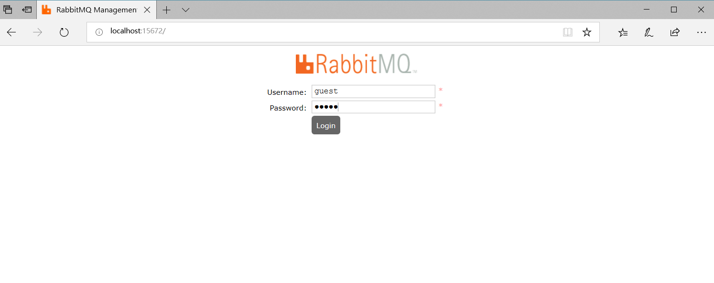

* 添加用户

  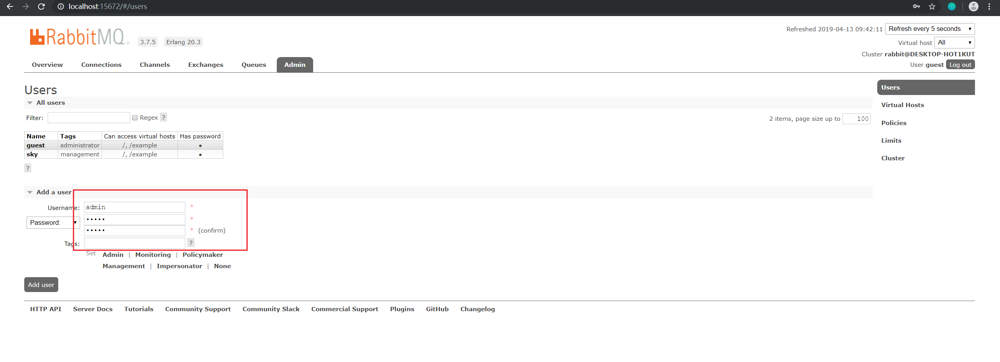

* virtual hosts管理

  virtual hosts 相当于mysql 的 db

  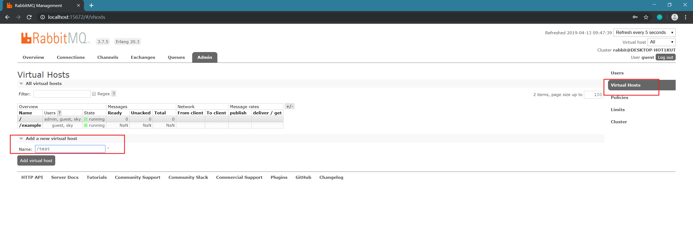

  一般以/开头，然后对用户授权

  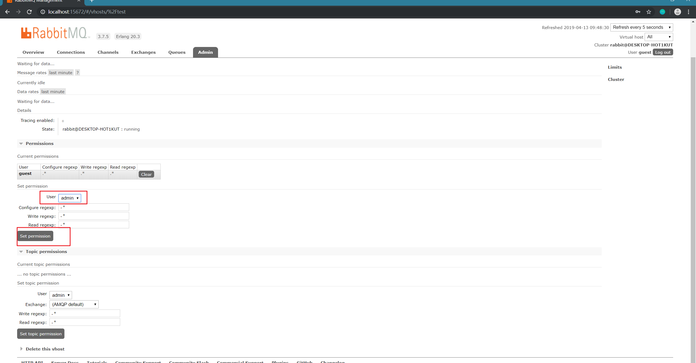

  

  可以看大授权后用户有对该virtual的权限

  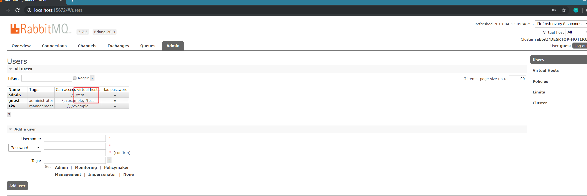


### 3. RabbitMQ工作模式

#### 3.1 工作模式简述

一共6种：简单队列模式、工作队列模式、发布订阅模式、路由模式、主题模式、RPC模式

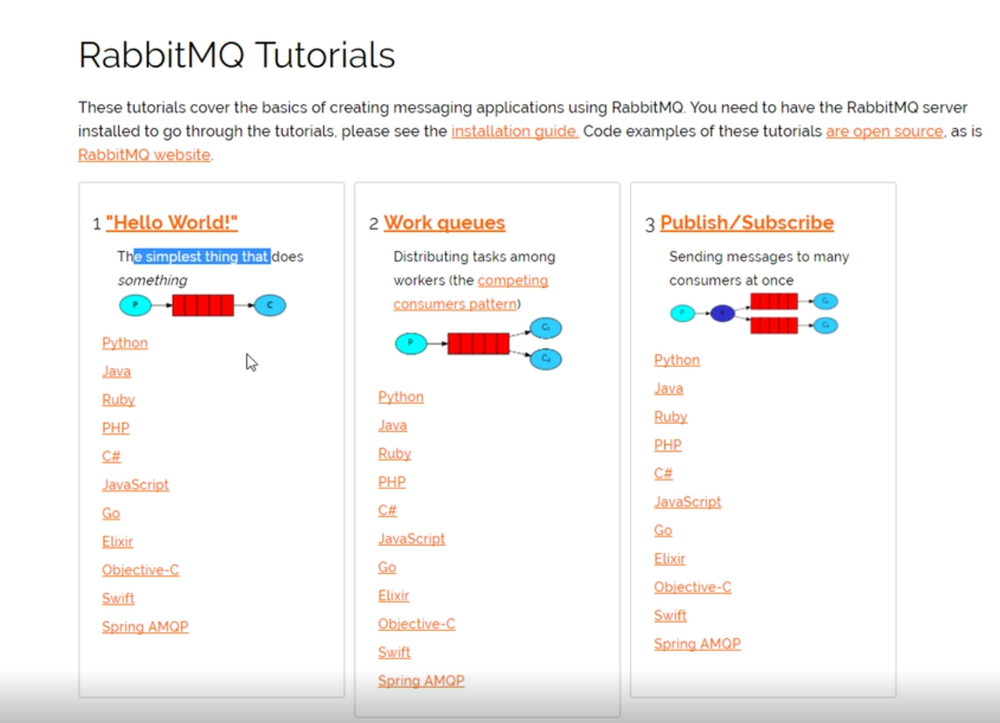

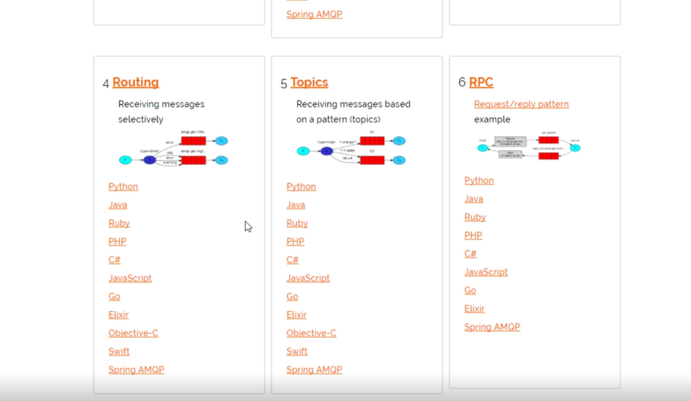

#### 3.2 简单队列

* 模型：一对一的模型，即一个生产者发送消息到一个队列，一个消费者监听队列进行消息消费处理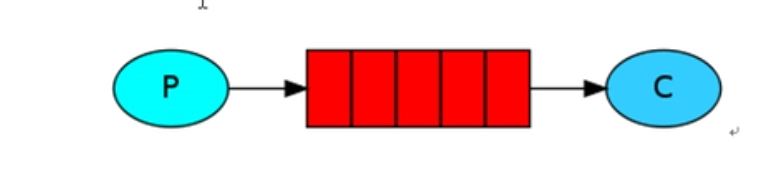![img]()P：消息的生产者  ；红色：队列 ；C：消息的消费者

* 代码示例：

   添加Maven依赖：

  ```java
  <dependency>
     <groupId>com.rabbitmq</groupId>
     <artifactId>amqp-client</artifactId>
     <version>5.2.0</version>
  </dependency>
  
  <dependency>
     <groupId>io.dropwizard.metrics</groupId>
     <artifactId>metrics-core</artifactId>
     <version>3.2.4</version>
  </dependency>
  
  <dependency>
     <groupId>io.micrometer</groupId>
     <artifactId>micrometer-core</artifactId>
     <version>1.0.0</version>
  </dependency>
  
  <dependency>
     <groupId>org.slf4j</groupId>
     <artifactId>slf4j-api</artifactId>
     <version>1.7.25</version>
  </dependency>
  ```

   连接工厂:

  ```java
  package com.example.simple;
  
  import java.io.IOException;
  import java.util.concurrent.TimeoutException;
  
  import com.rabbitmq.client.Connection;
  import com.rabbitmq.client.ConnectionFactory;
  
  /**
   * RabbitMQ连接工具类
   */
  public class ConnectionUtils {
      /**
       * 获取RabbitMQ连接
       */
      public static Connection getConnection() throws IOException, TimeoutException {
          //定义连接工厂
          ConnectionFactory connectionFactory = new ConnectionFactory();
          //设置服务地址
          connectionFactory.setHost("127.0.0.1");
          //设置AMQP监听端口
          connectionFactory.setPort(5672);
          //设置vhost
          connectionFactory.setVirtualHost("/example");
          //用户名
          connectionFactory.setUsername("admin");
          //密码
          connectionFactory.setPassword("admin");
          
          return connectionFactory.newConnection();
      }
  }
  ```

  生产者：

  ```java
  package com.example.simple;
  
  import java.io.IOException;
  import java.util.concurrent.TimeoutException;
  
  import com.rabbitmq.client.Channel;
  import com.rabbitmq.client.Connection;
  
  /**
   * 生产者：发布消息
   */
  public class Producer {
      //定义队列名称
      private static final String QUEUE_NAME = "test_queue_name";
  
      public static void main(String[] args) throws IOException, TimeoutException {
          //获取一个连接
          Connection connection = ConnectionUtils.getConnection();
  
          //从连接中获取一个通道
          Channel channel = connection.createChannel();
          //创建队列声明
          channel.queueDeclare(QUEUE_NAME, false, false, false, null);
  
          //定义要发送的消息
          String msg = "Hello RabbitMQ!";
          channel.basicPublish("", QUEUE_NAME, null, msg.getBytes());
          System.out.println("----发送了一条消息：" + msg);
  
          //关闭资源连接
          channel.close();
          connection.close();
      }
  }
  ```

  查看发送的消息：

  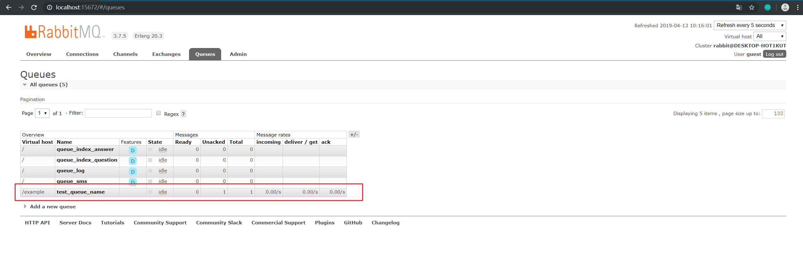

  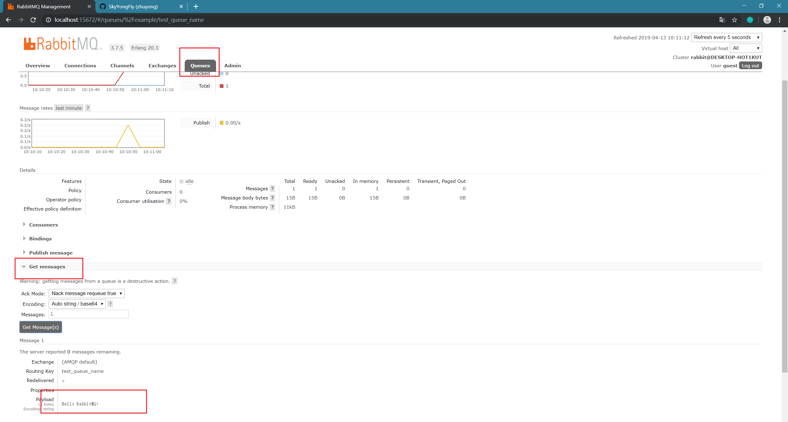

  消费者：

  获取队列消息（旧方法）：通过循环监听（严重浪费性能）

  ```java
  package com.example.simple;
  
  import java.io.IOException;
  import java.util.concurrent.TimeoutException;
  
  import com.rabbitmq.client.AMQP;
  import com.rabbitmq.client.Channel;
  import com.rabbitmq.client.Connection;
  import com.rabbitmq.client.DefaultConsumer;
  import com.rabbitmq.client.Envelope;
  
  /**
   * 消费者：获取生产者发送的消息
   */
  public class Consumer {
      //获取消息的队列名称
      private static final String QUEUE_NAME = "test_queue_name";
  
      private static void oldMethod() throws IOException, TimeoutException, InterruptedException {
          //获取连接
          Connection connection = ConnectionUtils.getConnection();
  
          //创建通道
          Channel channel = connection.createChannel();
  
          //定义队列消费者 (3.* 方法使用，最新版已经废弃，要想使用需要降低maven相关版本)
          QueueingConsumer consumer = new QueueingConsumer(channel);
  
          //监听队列
          channel.basicConsume(QUEUE_NAME, true, consumer);
          while (true){
              QueueingConsumer.Delivery delivery =  consumer.nextDelivery();
              String msg = new String(delivery.getBody());
  
              System.out.println("****收到了一条消息：" + msg);
          }
      }
  }
  ```

  新API方法：利用监听器机制

  ```java
  //获取消息的队列名称
      private static final String QUEUE_NAME = "test_queue_name";
  
      public static void main(String[] args) throws IOException, TimeoutException, InterruptedException {
          //获取连接
          Connection connection = ConnectionUtils.getConnection();
  
          //创建频道
          Channel channel = connection.createChannel();
          //队列声明
          channel.queueDeclare(QUEUE_NAME, false, false, false, null);
  
          //定义消费者
          DefaultConsumer consumer = new DefaultConsumer(channel){
              @Override
              public void handleDelivery(String consumerTag, Envelope envelope,
                                         AMQP.BasicProperties properties, byte[] body) throws IOException {
                  String msg = new String(body);
                  System.out.println("****收到了一条消息：" + msg);
              }
          };
  
          //监听队列
          channel.basicConsume(QUEUE_NAME, consumer);
      }
  ```

  运行后便得到了消息：

  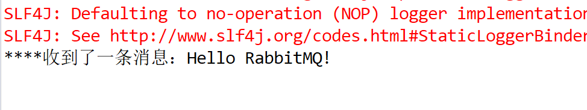

  控制台查看消息已经没有了：

  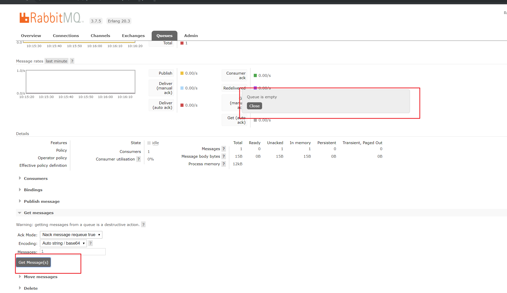

* 缺点

  耦合性高 ，生产者一一对应消费者对列名变更，要同时变更代码

#### **3.3 Work queues工作队列**

* 模型：同一个队列多个消费者

  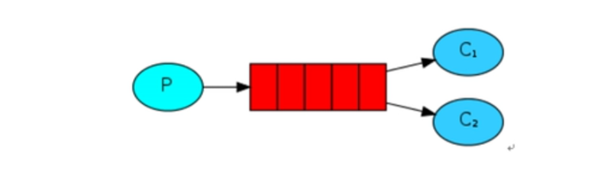

##### **3.3.1 轮询分发**

定义多个消费者，如果每个消费者消费的消息都一样多，这叫做轮询分发（round-robin）

生产者：发送50个消息

```java
package com.example.work;

import java.io.IOException;
import java.util.concurrent.TimeoutException;

import com.example.simple.ConnectionUtils;
import com.rabbitmq.client.Channel;
import com.rabbitmq.client.Connection;

/**
 * 工作队列之轮询分发生产者
 */
public class Producer {
    //定义队列名称
    private static final String QUEUE_NAME = "test_queue_name";

    public static void main(String[] args) throws IOException, TimeoutException {
        //获取一个连接
        Connection connection = ConnectionUtils.getConnection();

        //从连接中获取一个通道
        Channel channel = connection.createChannel();
        //创建队列声明
        channel.queueDeclare(QUEUE_NAME, false, false, false, null);

        for(int i = 0; i < 50; i++){
            //定义要发送的消息
            String msg = "Message [" + i + "]";
            //发送消息
            channel.basicPublish("", QUEUE_NAME, null, msg.getBytes());
            System.out.println("----发送了一条消息：" + msg);

            try {
                Thread.sleep(50);
            } catch (InterruptedException e) {
                e.printStackTrace();
            }
        }

        //关闭资源连接
        channel.close();
        connection.close();
    }

}
```

消费者1：

```java
package com.example.work;

import java.io.IOException;
import java.util.concurrent.TimeoutException;

import com.example.simple.ConnectionUtils;
import com.rabbitmq.client.AMQP;
import com.rabbitmq.client.Channel;
import com.rabbitmq.client.Connection;
import com.rabbitmq.client.DefaultConsumer;
import com.rabbitmq.client.Envelope;

/**
 * 工作队列之轮询分发消费者1
 */
public class Consumer1 {//获取消息的队列名称
    private static final String QUEUE_NAME = "test_queue_name";

    public static void main(String[] args) throws IOException, TimeoutException, InterruptedException {
        //获取连接
        Connection connection = ConnectionUtils.getConnection();

        //创建频道
        Channel channel = connection.createChannel();
        //队列声明
        channel.queueDeclare(QUEUE_NAME, false, false, false, null);

        //定义消费者
        DefaultConsumer consumer = new DefaultConsumer(channel){
            @Override
            public void handleDelivery(String consumerTag, Envelope envelope,
                                       AMQP.BasicProperties properties, byte[] body) throws IOException {
                String msg = new String(body, "UTF-8");
                System.out.println("****收到了一条消息：" + msg);

                try {
                    //模拟业务耗时操作
                    Thread.sleep(50);
                } catch (InterruptedException e) {
                    e.printStackTrace();
                }finally {
                    System.out.println(msg + "：处理完成");
                }
            }
        };

        //监听队列
        boolean autoAck = true; //自动应答
        channel.basicConsume(QUEUE_NAME, autoAck,consumer);
    }
}
```

消费者2：

```java
package com.example.work;

import com.example.simple.ConnectionUtils;
import com.rabbitmq.client.*;

import java.io.IOException;
import java.util.concurrent.TimeoutException;

/**
 * 工作队列之轮询分发消费者2
 */
public class Consumer2 {//获取消息的队列名称
    private static final String QUEUE_NAME = "test_queue_name";

    public static void main(String[] args) throws IOException, TimeoutException, InterruptedException {
        //获取连接
        Connection connection = ConnectionUtils.getConnection();

        //创建频道
        Channel channel = connection.createChannel();
        //队列声明
        channel.queueDeclare(QUEUE_NAME, false, false, false, null);

        //定义消费者
        DefaultConsumer consumer = new DefaultConsumer(channel){
            @Override
            public void handleDelivery(String consumerTag, Envelope envelope,
                                       AMQP.BasicProperties properties, byte[] body) throws IOException {
                String msg = new String(body, "UTF-8");
                System.out.println("****收到了一条消息：" + msg);

                try {
                    //模拟业务耗时操作
                    Thread.sleep(100);
                } catch (InterruptedException e) {
                    e.printStackTrace();
                }finally {
                    System.out.println(msg + "：处理完成");
                }
            }
        };

        //监听队列
        boolean autoAck = true; //自动应答
        channel.basicConsume(QUEUE_NAME, autoAck,consumer);
    }
}
```

注意先启动两个消费者，不然先启动生产者发送消息，再启动消费者时候，第一个消费者启动完成了会直接把所有的消息都消费掉，导致观察不到轮询分发的现象。现在我们先启动了两个消费者等待消息，再启动生产者发送消息：

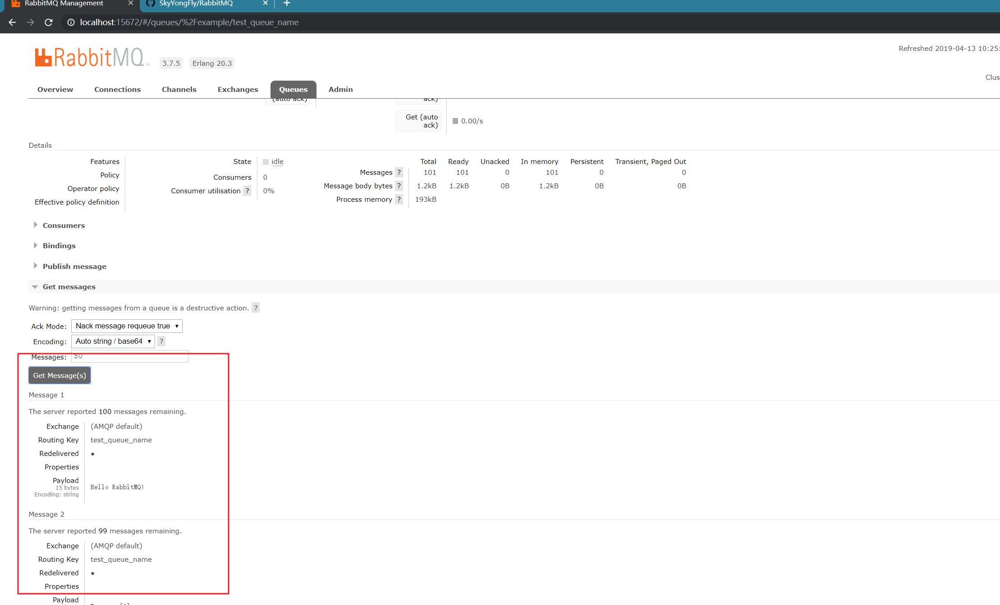

消费者1控制台输出：

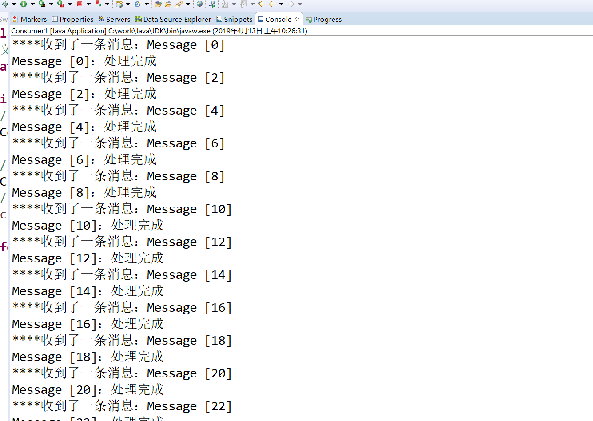

消费者2控制台输出：

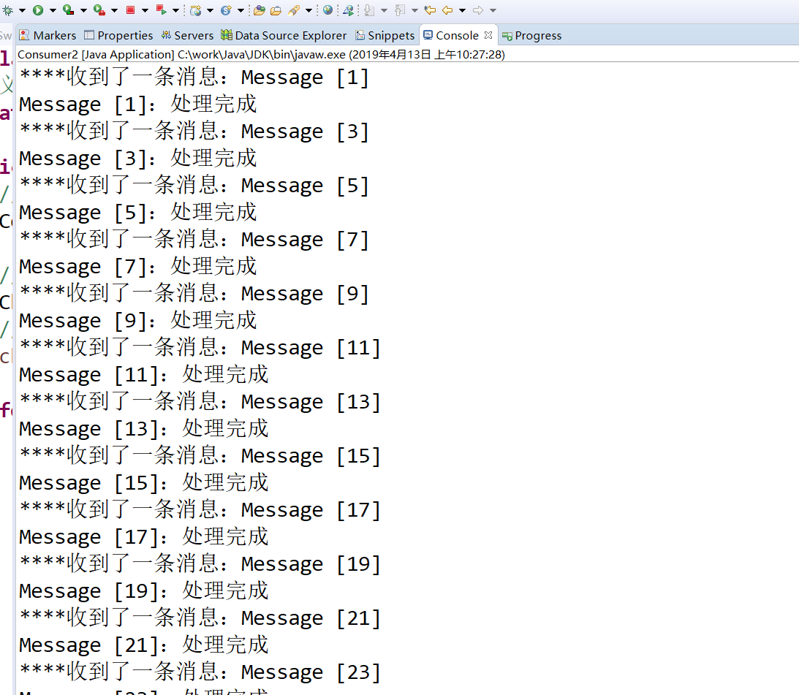

可以看到两个消费者依次消费消息，且保证两个消费的的数量公平性；

##### **3.3.2 公平分发**

公平分发:采用手动应答的方式，即消费者处理完成通知队列处理完成，这样处理快的客户端可以分到更多的消息

生产者：

```java
package com.example.workfair;

import java.io.IOException;
import java.util.concurrent.TimeoutException;

import com.example.simple.ConnectionUtils;
import com.rabbitmq.client.Channel;
import com.rabbitmq.client.Connection;

/**
 * 工作队列之公平分发生产者
 */
public class Producer {
    //定义队列名称
    private static final String QUEUE_NAME = "test_queue_name";

    public static void main(String[] args) throws IOException, TimeoutException {
        //获取一个连接
        Connection connection = ConnectionUtils.getConnection();

        //从连接中获取一个通道
        Channel channel = connection.createChannel();
        //创建队列声明
        channel.queueDeclare(QUEUE_NAME, false, false, false, null);

        //设置每次发送到队列的消息只有一个，需要等到消费者发送处理完的响应后才继续发送消息
        int prefetchCount = 1;
        channel.basicQos(prefetchCount);

        for(int i = 0; i < 50; i++){
            //定义要发送的消息
            String msg = "Message [" + i + "]";
            //发送消息
            channel.basicPublish("", QUEUE_NAME, null, msg.getBytes());
            System.out.println("----发送了一条消息：" + msg);

            try {
                Thread.sleep(50);
            } catch (InterruptedException e) {
                e.printStackTrace();
            }
        }

        //关闭资源连接
        channel.close();
        connection.close();
    }

}
```

重点在于消息的再次发送等待前一个消费完成：

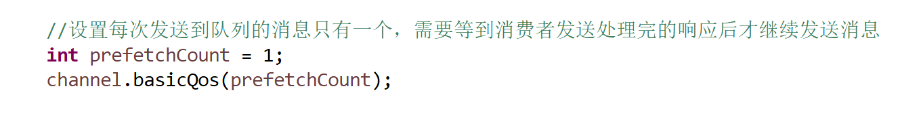

消费者1：

```java
package com.example.workfair;

import com.example.simple.ConnectionUtils;
import com.rabbitmq.client.*;

import java.io.IOException;
import java.util.concurrent.TimeoutException;

/**
 * 工作队列之公平分发消费者1
 */
public class Consumer1 {//获取消息的队列名称
    private static final String QUEUE_NAME = "test_queue_name";

    public static void main(String[] args) throws IOException, TimeoutException, InterruptedException {
        //获取连接
        Connection connection = ConnectionUtils.getConnection();
        //创建频道
        final Channel channel = connection.createChannel();
        //队列声明
        channel.queueDeclare(QUEUE_NAME, false, false, false, null);
        //保证队列一次只分发一个
        channel.basicQos(1);

        //定义消费者
        DefaultConsumer consumer = new DefaultConsumer(channel){
            @Override
            public void handleDelivery(String consumerTag, Envelope envelope,
                                       AMQP.BasicProperties properties, byte[] body) throws IOException {
                String msg = new String(body, "UTF-8");
                System.out.println("****收到了一条消息：" + msg);

                try {
                    //模拟业务耗时操作
                    Thread.sleep(50);
                } catch (InterruptedException e) {
                    e.printStackTrace();
                }finally {
                    System.out.println(msg + "：处理完成");
                    //处理完成手动应答
                    channel.basicAck(envelope.getDeliveryTag(), false);
                }
            }
        };

        //监听队列
        boolean autoAck = false; //自动应答关闭
        channel.basicConsume(QUEUE_NAME, autoAck,consumer);
    }
}
```

消费者2：

```java
package com.example.workfair;

import java.io.IOException;
import java.util.concurrent.TimeoutException;

import com.example.simple.ConnectionUtils;
import com.rabbitmq.client.AMQP;
import com.rabbitmq.client.Channel;
import com.rabbitmq.client.Connection;
import com.rabbitmq.client.DefaultConsumer;
import com.rabbitmq.client.Envelope;

/**
 * 工作队列之公平分发消费者2
 */
public class Consumer2 {//获取消息的队列名称
    private static final String QUEUE_NAME = "test_queue_name";

    public static void main(String[] args) throws IOException, TimeoutException, InterruptedException {
        //获取连接
        Connection connection = ConnectionUtils.getConnection();

        //创建频道
        final Channel channel = connection.createChannel();
        //队列声明
        channel.queueDeclare(QUEUE_NAME, false, false, false, null);

        //保证队列一次只分发一个
        channel.basicQos(1);

        //定义消费者
        DefaultConsumer consumer = new DefaultConsumer(channel){
            @Override
            public void handleDelivery(String consumerTag, Envelope envelope,
                                       AMQP.BasicProperties properties, byte[] body) throws IOException {
                String msg = new String(body, "UTF-8");
                System.out.println("****收到了一条消息：" + msg);

                try {
                    //模拟业务耗时操作
                    Thread.sleep(500);
                } catch (InterruptedException e) {
                    e.printStackTrace();
                }finally {
                    System.out.println(msg + "：处理完成");
                    //处理完成手动应答
                    channel.basicAck(envelope.getDeliveryTag(), false);
                }
            }
        };

        //监听队列
        boolean autoAck = false; //自动应答关闭
        channel.basicConsume(QUEUE_NAME, autoAck,consumer);
    }
}
```

启动消费者再启动生产者后：

消费者1消费：

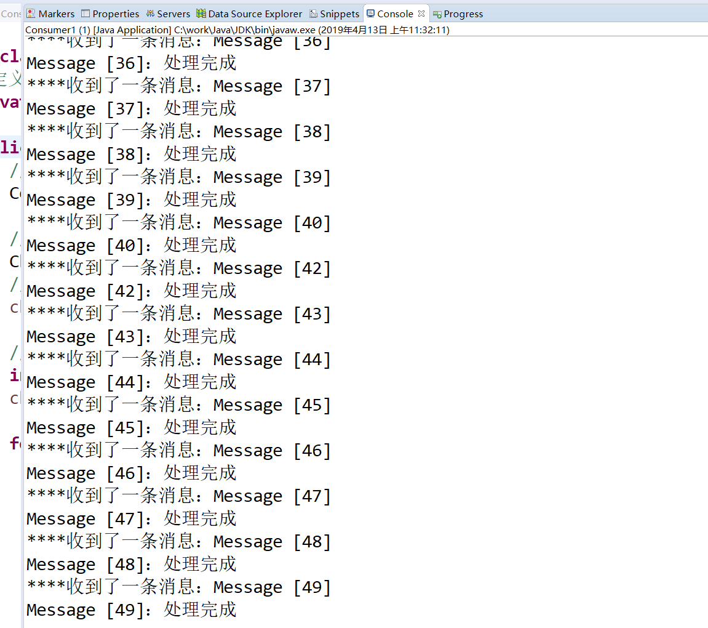

消费者2消费：

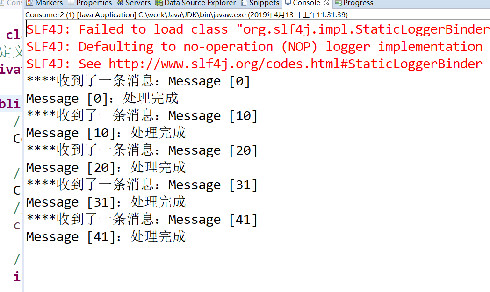

可以看到两个消费者消费消息并不是公平的，谁消费的快谁处理的消息就多；

#### **3.4 消息应答ack与消息持久化durable**

* boolean autoAck = true 

  自动确认模式：一旦rabbitmq将消息分发给消费者，就会从内存中删除；

  缺点：如果杀死正在执行的消费者，就会丢失正在处理的消息；

* boolean autoAck = false 

  手动确认模式：如果有一个消费者挂掉，就会交付给其他消费者；

  rabbitmq支持消息应答，消费者发送一个消息应答，告诉rabbitmq这个消息我已经处理完成，你可以删除了，然后rabbitmq就会删除内存中的消息；

* 消息应答默认是打开的，但是如果rabbitmq的服务器挂了，消息会消失，所以需要持久化消息
  消息持久化：

  ```java
  //声明队列
  boolean durable = false;
  channel.queueDeclare(QUEUE_NAME, durable, false, false, null);
  ```


  对于已经定义的队列queue，不允许重新定义；

#### **3.5 publish_subscribe订阅模式**

* 模型

  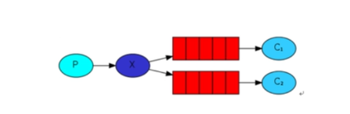

  1、一个生产者，多个消费者；

  2、每个消费者都有自己的队列；

  3、生产者没有直接把消息发送到队列，而是发送到了交换机 转发器  exchange；

  4、每个队列都要绑定到交换机上；

  5、生产者发送的消息经过交换机 到达队列  就能实现 一个消息被多个消费者消费；

* 代码示例

  生产者：

  ```java
  package com.example.ps;
  
  import java.io.IOException;
  import java.util.concurrent.TimeoutException;
  
  import com.example.simple.ConnectionUtils;
  import com.rabbitmq.client.Channel;
  import com.rabbitmq.client.Connection;
  
  /**
   * 订阅模式生产者：只负责把消息发送到交换机
   */
  public class Producer {
      //定义交换机名称
      private static final String EXCHANGE_NAME = "test_exchange_name";
  
      public static void main(String[] args) throws IOException, TimeoutException {
          //获取一个连接
          Connection connection = ConnectionUtils.getConnection();
  
          //从连接中获取一个通道
          Channel channel = connection.createChannel();
  
          //声明交换机
          channel.exchangeDeclare(EXCHANGE_NAME, "fanout"); //分发
          //发送消息
          String msg = "Hello Publish_Subscribe !";
          channel.basicPublish(EXCHANGE_NAME, "", null, msg.getBytes());
          System.out.println("****发送了一条消息：" + msg);
  
          //关闭资源连接
          channel.close();
          connection.close();
      }
  }
  ```

  控制台查看交换机：

  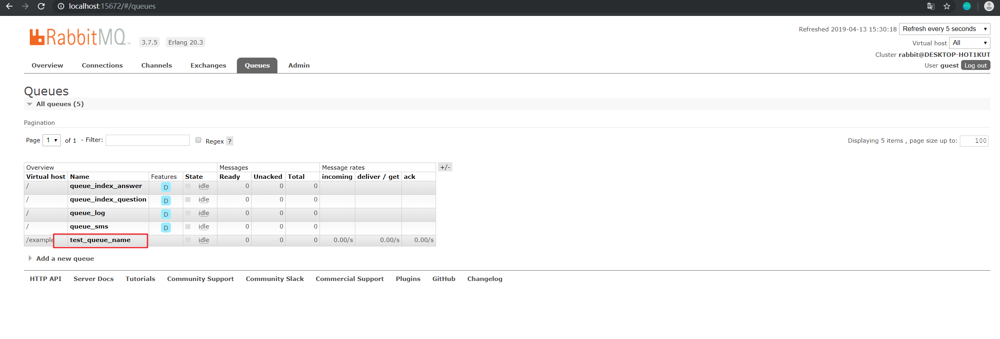

  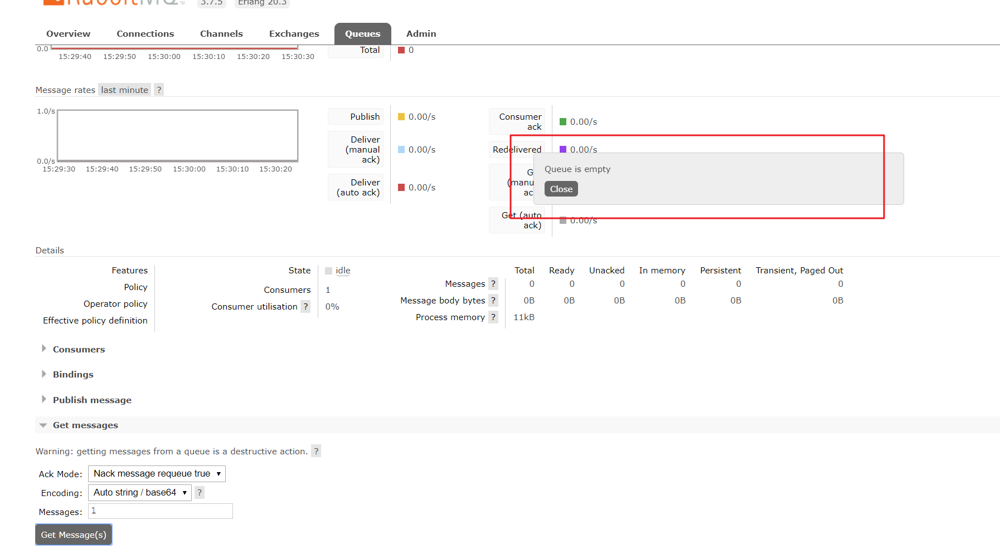

  **但是却不存在消息，因为消息已经丢失了，交换机是没有存储消息的能力的，只有队列queue能存储消息，所以我们需要消费者产生队列绑定到交换机exchange**

  

  消费者1：

  ```java
  package com.example.ps;
  
  import java.io.IOException;
  import java.util.concurrent.TimeoutException;
  
  import com.example.simple.ConnectionUtils;
  import com.rabbitmq.client.AMQP;
  import com.rabbitmq.client.Channel;
  import com.rabbitmq.client.Connection;
  import com.rabbitmq.client.DefaultConsumer;
  import com.rabbitmq.client.Envelope;
  
  /**
   * 订阅模式消费者1：产生一个队列，绑定到交换机，获取消息
   */
  public class Consumer1 {
      //定义交换机名称
      private static final String EXCHANGE_NAME = "test_exchange_name";
      //设置消息的队列名称，例如发送邮件的队列
      private static final String QUEUE_NAME = "test_queue_email";
  
      public static void main(String[] args) throws IOException, TimeoutException, InterruptedException {
          //获取连接
          Connection connection = ConnectionUtils.getConnection();
          //创建频道
          final Channel channel = connection.createChannel();
          //队列声明
          channel.queueDeclare(QUEUE_NAME, false, false, false, null);
  
          //绑定队列到交换机
          channel.queueBind(QUEUE_NAME, EXCHANGE_NAME, "");
  
          //保证队列一次只分发一个
          channel.basicQos(1);
  
          //定义消费者
          DefaultConsumer consumer = new DefaultConsumer(channel){
              @Override
              public void handleDelivery(String consumerTag, Envelope envelope,
                                         AMQP.BasicProperties properties, byte[] body) throws IOException {
                  String msg = new String(body, "UTF-8");
                  System.out.println("****收到了一条消息：" + msg);
  
                  try {
                      //模拟业务耗时操作
                      Thread.sleep(50);
                  } catch (InterruptedException e) {
                      e.printStackTrace();
                  }finally {
                      System.out.println(msg + "：处理完成");
                      //处理完成手动应答
                      channel.basicAck(envelope.getDeliveryTag(), false);
                  }
              }
          };
  
          //监听队列
          boolean autoAck = false; //自动应答关闭
          channel.basicConsume(QUEUE_NAME, autoAck,consumer);
      }
  }
  ```

  消费者2：

  ```java
  package com.example.ps;
  
  import java.io.IOException;
  import java.util.concurrent.TimeoutException;
  
  import com.example.simple.ConnectionUtils;
  import com.rabbitmq.client.AMQP;
  import com.rabbitmq.client.Channel;
  import com.rabbitmq.client.Connection;
  import com.rabbitmq.client.DefaultConsumer;
  import com.rabbitmq.client.Envelope;
  
  /**
   * 订阅模式消费者2：产生一个队列，绑定到交换机，获取消息
   */
  public class Consumer2 {
      //定义交换机名称
      private static final String EXCHANGE_NAME = "test_exchange_name";
      //设置消息的队列名称，例如发送短信的队列
      private static final String QUEUE_NAME = "test_queue_sms";
  
      public static void main(String[] args) throws IOException, TimeoutException, InterruptedException {
          //获取连接
          Connection connection = ConnectionUtils.getConnection();
          //创建频道
          final Channel channel = connection.createChannel();
          //队列声明
          channel.queueDeclare(QUEUE_NAME, false, false, false, null);
  
          //绑定队列到交换机
          channel.queueBind(QUEUE_NAME, EXCHANGE_NAME, "");
  
          //保证队列一次只分发一个
          channel.basicQos(1);
  
          //定义消费者
          DefaultConsumer consumer = new DefaultConsumer(channel){
              @Override
              public void handleDelivery(String consumerTag, Envelope envelope,
                                         AMQP.BasicProperties properties, byte[] body) throws IOException {
                  String msg = new String(body, "UTF-8");
                  System.out.println("****收到了一条消息：" + msg);
  
                  try {
                      //模拟业务耗时操作
                      Thread.sleep(500);
                  } catch (InterruptedException e) {
                      e.printStackTrace();
                  }finally {
                      System.out.println(msg + "：处理完成");
                      //处理完成手动应答
                      channel.basicAck(envelope.getDeliveryTag(), false);
                  }
              }
          };
  
          //监听队列
          boolean autoAck = false; //自动应答关闭
          channel.basicConsume(QUEUE_NAME, autoAck,consumer);
      }
  }
  ```

  现在生产者发送一条消息试试：

  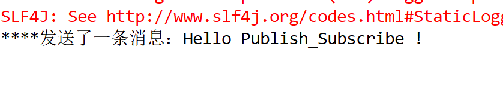

  消费者1和消费者2都接收到了这条消息：

  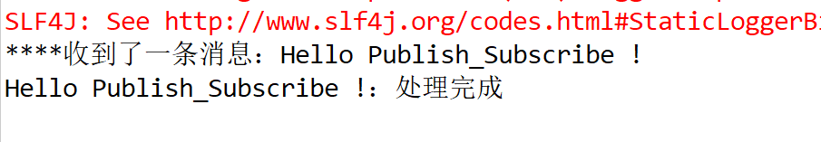

* 转发器

  Exchange(交换机 转发器)：一方面接受生产者的消息，另一方面向队列推送消息匿名转发；
  上面例子指定了fanout模式Fanout(不处理路由键)；

  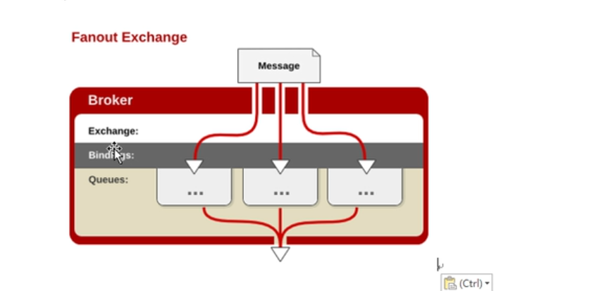

